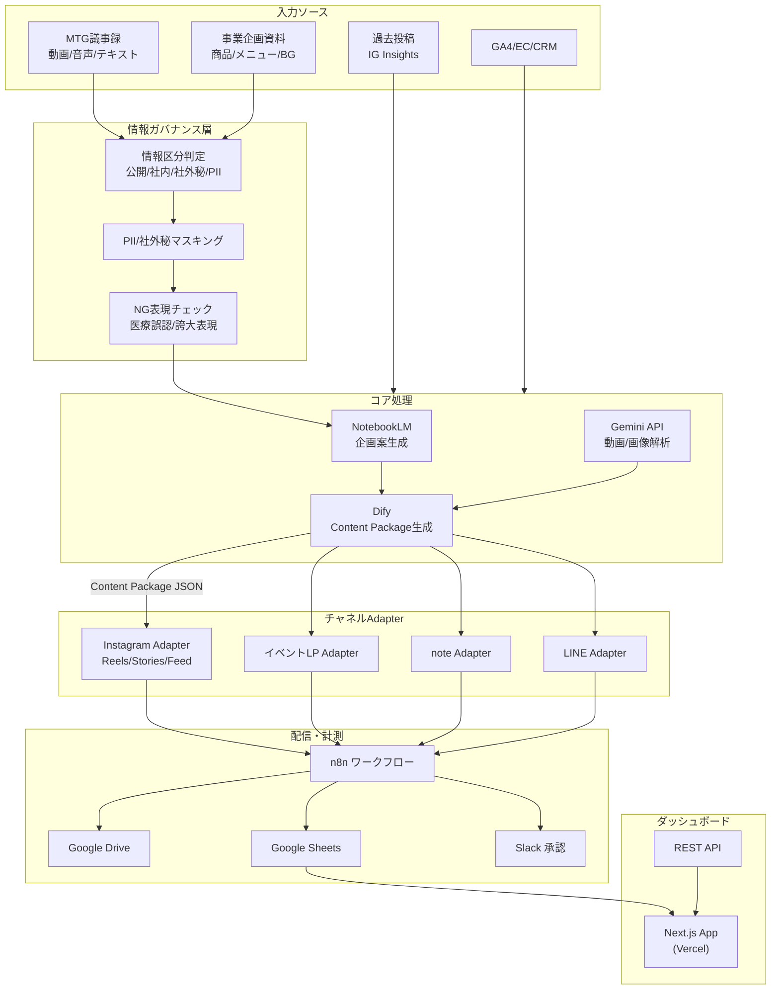
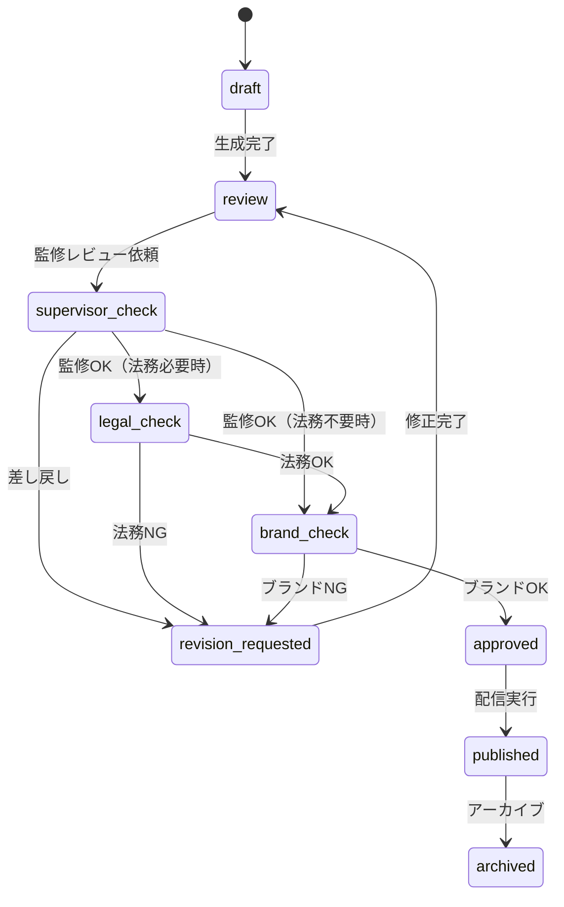

# FAM マルチチャネル・コンテンツ運用 システム仕様書

## 1. 全体アーキテクチャ



## 2. データパイプライン仕様

### 2.1 Ingest パイプライン

| ステップ | 処理 | ツール | 出力 |
|---------|------|--------|------|
| 1 | 動画/音声アップロード | Google Drive | ファイルURL |
| 2 | 文字起こし | Gemini API / Whisper | テキスト |
| 3 | 要点抽出 | NotebookLM | 構造化サマリー |
| 4 | 話者判定 | Gemini API | 話者ラベル付きテキスト |
| 5 | テーマ分類 | Dify | タグ（目的/ファネル/ペルソナ） |
| 6 | 情報区分判定 | Dify + ルール | public/internal/confidential/pii |

### 2.2 Content Package（Source of Truth）

型定義: `src/types/content_package.ts`

```json
{
  "campaign_id": "camp_001",
  "content_id": "cnt_001",
  "version": 1,
  "status": "draft",
  "info_classification": "public",
  "objective": "acquisition",
  "funnel_stage": "awareness",
  "persona": ["academy_student"],
  "title": "試合前72時間の栄養戦略",
  "summary": "カーボローディングの科学的根拠と実践法",
  "key_messages": [
    {
      "claim": "炭水化物ローディングにより筋グリコーゲンが最大2倍になる可能性がある",
      "evidence": [
        {
          "id": "ev_001",
          "type": "citation",
          "source": "Hawley et al., Sports Med, 1997",
          "confidence": "high"
        }
      ],
      "supervised_by": "管理栄養士 田中"
    }
  ],
  "disclaimers": ["※個人差があります。具体的な食事計画は専門家にご相談ください。"],
  "do_not_say": ["絶対", "必ず痩せる", "治る"],
  "risk_flags": [],
  "cta_set": [
    {
      "label": "無料体験に申し込む",
      "url_template": "https://fam.example.com/academy/trial?utm_source={{source}}",
      "type": "signup"
    }
  ],
  "utm_plan": {
    "source": "instagram",
    "medium": "social",
    "campaign": "spring_academy_2026"
  },
  "asset_plan": [
    {
      "asset_type": "video",
      "purpose": "reels_main",
      "width": 1080,
      "height": 1920,
      "template_id": "tpl_reels_edu"
    }
  ],
  "target_channels": ["instagram_reels", "instagram_feed", "note", "line"]
}
```

### 2.3 Drive/Sheets 設計

#### フォルダ構成
```
fam_content_ops/
├── campaigns/
│   └── {campaign_id}/
│       ├── source/          # 原稿・企画書
│       ├── assets/          # 画像・動画素材
│       ├── variants/        # チャネル別派生物
│       └── reports/         # レポート
├── templates/               # プロンプト・デザインテンプレ
├── brand_guidelines/        # ブランドガイドライン
└── archive/                 # アーカイブ
```

#### 命名規則
- フォルダ/ファイル名: `snake_case`（英数字のみ）
- 例: `camp_001_cnt_001_ig_reels_v2.json`

### 2.4 情報ガバナンス仕様

#### PII/社外秘マスキング規則
| 対象 | 検出方法 | マスク方法 |
|------|---------|-----------|
| 氏名 | 正規表現 + NER | `[氏名]` に置換 |
| 電話番号 | 正規表現 `0\d{1,4}-?\d{1,4}-?\d{4}` | `[電話番号]` |
| メールアドレス | 正規表現 | `[メール]` |
| 社内KPI/売上 | キーワードマッチ | ブロック（公開不可） |

#### 承認フロー


## 3. チャネル別 Adapter 仕様

### 3.1 Instagram Adapter

#### Reels
| フィールド | 仕様 |
|-----------|------|
| 台本構造 | Hook(3秒)→課題提示(10秒)→エビデンス(20秒)→実践例(15秒)→CTA(7秒) |
| 尺 | 30〜90秒 |
| テロップ | 各セクション見出し＋要点（20文字以内/行） |
| BGM案 | テンポ/ジャンル指定（著作権フリー前提） |
| サムネ文言 | 20文字以内、疑問形 or 数字訴求 |
| キャプション | 300文字以内、改行あり、CTA含む |
| ハッシュタグ | 最大15個（大/中/小ボリューム混合） |
| 免責 | キャプション末尾に記載 |

#### Stories
| タイプ | テンプレ構成 |
|--------|------------|
| 投票/質問 | 背景画像＋スタンプ＋問いかけ文（15文字） |
| イベント告知 | カウントダウン＋概要＋リンクスタンプ |
| 誘導 | Reels/Feed/LP/noteへのリンク＋訴求文 |
| ステップ構成 | 3〜5枚で1つの学びを提供 |

#### Feed（カルーセル）
| スライド | 内容 |
|---------|------|
| 1 | 表紙：課題提起 or 数字フック |
| 2 | よくある誤解 |
| 3 | 正しい理解（エビデンス付き） |
| 4 | 実践方法 |
| 5 | CTA＋免責＋監修者名 |

### 3.2 イベントLP Adapter

#### 生成物
| セクション | 内容 |
|-----------|------|
| Hero | タイトル / サブコピー / 日時・場所・対象・参加費 / CTA |
| 価値提案 | 3つのベネフィット（箇条書き） |
| アジェンダ | タイムテーブル形式 |
| 登壇者 | 名前・肩書・写真指定・実績 |
| FAQ | 5〜8問（構造化データ対応） |
| 免責 | 下部に記載 |
| SEO | meta title(60文字) / description(120文字) / OGテキスト |
| 構造化データ | Event schema (JSON-LD) |

#### 実装方式
- **A案（推奨MVP）**: Content Package → LP JSON → Next.js テンプレートで静的生成 → Vercelデプロイ
- **B案（将来）**: Headless CMS (microCMS等) に下書き登録 → 人が最終編集 → 公開

#### 計測設計
```
GA4イベント:
  - page_view（自動）
  - cta_click（ボタンクリック）
  - form_start（フォーム入力開始）
  - form_submit（送信完了）

UTMパラメータ: campaign_id と連携
  ?utm_source={channel}&utm_medium={medium}&utm_campaign={campaign_id}
```

### 3.3 note Adapter

#### 生成物
| 要素 | 仕様 |
|------|------|
| タイトル案 | 3案（数字訴求/疑問形/宣言形） |
| リード文 | 100文字以内、記事の価値を端的に |
| 本文 | Markdown、見出しh2×3〜5、h3適宜 |
| 引用・根拠 | blockquoteで引用し、引用元を明記 |
| 免責 | 記事末尾に定型文 |
| タグ | 5〜10個 |
| OG画像テキスト | 25文字以内 |
| CTA | 記事末尾にイベント申込/問い合わせ導線 |

#### 運用フロー
note APIでの自動投稿が困難な場合:
1. Dify → Markdown生成 → Google Drive保存
2. 担当者がDriveからコピー → note下書きにペースト
3. 画像は別途アップロード（バナー差し込み指示に従う）
4. 公開後、URLをSheetsに記録 → 計測開始

### 3.4 LINE Adapter

#### 一斉配信メッセージ
```json
{
  "type": "text",
  "text": "【NEW】試合前の食事、なんとなくで決めてませんか？\n\n科学的な栄養戦略を学べる無料体験、受付中！\n\n▼ 詳細・お申し込み\nhttps://fam.example.com/academy/trial",
  "segment": "academy_student"
}
```

#### セグメント別出し分け
| セグメント | 訴求軸 | CTA |
|-----------|--------|-----|
| B2B(チーム) | 選手のパフォーマンス向上実績 | 資料DL/問い合わせ |
| B2C(サブスク) | 日常の栄養改善、継続メリット | 購入/継続特典 |
| アカデミー | 学びの価値、キャリア | 無料体験申込 |

#### ステップ配信（イベント例）
| タイミング | メッセージ内容 |
|-----------|-------------|
| 7日前 | イベント告知＋早期申込メリット |
| 3日前 | 登壇者紹介＋見どころ |
| 前日 | リマインダー＋準備事項 |
| 当日 | 会場案内/接続URL |
| 翌日 | お礼＋アンケート＋次回案内 |

#### リッチメッセージ Design Manifest
```json
{
  "template_id": "tpl_line_rich_event",
  "size": { "width": 1040, "height": 1040 },
  "text_slots": {
    "title": "スポーツ栄養アカデミー 無料体験",
    "date": "2026年3月15日(日) 14:00〜",
    "cta": "今すぐ申し込む"
  },
  "image_slots": {
    "background": "assets/line_bg_academy.png"
  },
  "export_name": "camp_001_line_rich",
  "format": "png"
}
```

## 4. n8n ワークフロー ノード一覧

### 4.1 Ingest ワークフロー
| # | ノード | 種別 | 処理内容 |
|---|--------|------|---------|
| 1 | Google Drive Trigger | Trigger | 新規ファイル検知 |
| 2 | File Type Router | Switch | 動画/音声/テキスト振り分け |
| 3 | Gemini Transcribe | HTTP Request | Gemini APIで文字起こし |
| 4 | NotebookLM Extract | HTTP Request | 要点抽出・企画案生成 |
| 5 | Dify Classify | HTTP Request | テーマ分類・情報区分判定 |
| 6 | PII Mask | Function | PII正規表現マスキング |
| 7 | Sheets Write | Google Sheets | ingest_log に記録 |

### 4.2 Generate ワークフロー
| # | ノード | 種別 | 処理内容 |
|---|--------|------|---------|
| 1 | Manual/Schedule Trigger | Trigger | 手動 or 定期実行 |
| 2 | Sheets Read | Google Sheets | 未生成コンテンツ取得 |
| 3 | Dify Planner | HTTP Request | 企画 → Content Package生成 |
| 4 | NG Check | Function | do_not_say/risk_flags検証 |
| 5 | Channel Router | Switch | target_channels別に分岐 |
| 6 | Dify IG Adapter | HTTP Request | Instagram派生生成 |
| 7 | Dify LP Adapter | HTTP Request | LP派生生成 |
| 8 | Dify Note Adapter | HTTP Request | note派生生成 |
| 9 | Dify LINE Adapter | HTTP Request | LINE派生生成 |
| 10 | Drive Save | Google Drive | JSON/Markdown保存 |
| 11 | Sheets Update | Google Sheets | content_master更新 |

### 4.3 Review ワークフロー
| # | ノード | 種別 | 処理内容 |
|---|--------|------|---------|
| 1 | Sheets Trigger | Trigger | ステータス=review検知 |
| 2 | Slack Notify | Slack | レビュー依頼通知 |
| 3 | Slack Wait | Wait | 承認/差し戻し待ち |
| 4 | Decision Router | Switch | approved/rejected/revision |
| 5 | Sheets Update | Google Sheets | review_log記録 |
| 6 | Feedback Log | Function | ラベル抽出・記録 |

### 4.4 Publish ワークフロー
| # | ノード | 種別 | 処理内容 |
|---|--------|------|---------|
| 1 | Schedule Trigger | Trigger | 配信予定時刻チェック |
| 2 | Sheets Read | Google Sheets | approved & scheduled取得 |
| 3 | IG Publish | HTTP Request | Instagram Graph API |
| 4 | LINE Push | HTTP Request | LINE Messaging API |
| 5 | LP Deploy | HTTP Request | Vercel Deploy Hook |
| 6 | Note Draft | Google Drive | note用Markdown保存（手動投稿） |
| 7 | Status Update | Google Sheets | publish_jobs更新 |
| 8 | Slack Notify | Slack | 配信完了通知 |

### 4.5 Measure ワークフロー
| # | ノード | 種別 | 処理内容 |
|---|--------|------|---------|
| 1 | Schedule Trigger | Trigger | 毎日9:00実行 |
| 2 | IG Insights | HTTP Request | Instagram Insights API |
| 3 | GA4 Query | HTTP Request | GA4 Data API |
| 4 | LINE Stats | HTTP Request | LINE統計API |
| 5 | Merge | Merge | 全チャネル指標統合 |
| 6 | Sheets Write | Google Sheets | metrics_daily更新 |

### 4.6 Report ワークフロー
| # | ノード | 種別 | 処理内容 |
|---|--------|------|---------|
| 1 | Schedule Trigger | Trigger | 毎週月曜9:00 |
| 2 | Sheets Read | Google Sheets | 週次メトリクス集計 |
| 3 | Dify Analysis | HTTP Request | AI分析・改善提案 |
| 4 | Slack Post | Slack | 週次レポート投稿 |
| 5 | Drive Save | Google Drive | レポートPDF保存 |

## 5. Dify プロンプト雛形

### 5.1 Planner（企画プロンプト）

```
あなたはFAMのスポーツ栄養コンテンツ企画担当AIです。

## 入力
- MTG要点: {{extracted_summary}}
- 事業目的: {{objective}}
- ターゲット: {{persona}}
- ファネル段階: {{funnel_stage}}

## タスク
以下のJSON形式でContent Packageを生成してください。

## ルール
1. key_messagesには必ず科学的根拠（evidence）を付与すること
2. 根拠が不明確な場合はconfidence: "low"とし、確認が必要な旨をrisk_flagsに追加
3. do_not_sayリストの表現は絶対に使わない: ["絶対","必ず痩せる","治る","医学的に証明"]
4. 免責文を必ず含める
5. info_classificationを適切に判定し、publicでない情報は除外する

## 出力形式
Content Package JSON（src/types/content_package.ts の型に準拠）
```

### 5.2 Instagram Adapter プロンプト

```
あなたはFAMのInstagramコンテンツ制作AIです。

## 入力
- Content Package: {{content_package_json}}
- チャネル: {{channel_type}} (reels/stories/feed)

## タスク（Reelsの場合）
1. 台本を生成: Hook(3秒)→課題(10秒)→エビデンス(20秒)→実践(15秒)→CTA(7秒)
2. テロップ案（各セクション見出し、20文字以内/行）
3. サムネ文言（20文字以内、疑問形or数字）
4. キャプション（300文字以内、改行あり）
5. ハッシュタグ（最大15個）

## ルール
- 断定表現禁止。「〜の可能性がある」「〜が示唆されている」を使う
- 免責をキャプション末尾に必ず入れる
- 根拠の引用元をキャプション内または固定コメントで示す
- do_not_sayの語は使用しない

## 出力
JSON形式（ChannelVariant.body に格納される構造）
```

### 5.3 LP Adapter プロンプト

```
あなたはFAMのイベントLP制作AIです。

## 入力
- Content Package: {{content_package_json}}
- イベント詳細: {{event_details}}

## タスク
以下のセクションを生成:
1. hero: title, subtitle, date, location, audience, price, cta_text
2. value_propositions: 3つのベネフィット
3. agenda: タイムテーブル
4. speakers: 登壇者情報
5. faq: 5〜8問
6. seo: meta_title(60字), meta_description(120字), og_text
7. structured_data: Event JSON-LD
8. disclaimers: 免責事項

## ルール
- 科学的根拠に基づく表現のみ
- 誇大広告禁止（景品表示法に配慮）
- CTAは具体的な行動を示す
- FAQ内で医療的アドバイスをしない

## 出力
LP JSON
```

### 5.4 note Adapter プロンプト

```
あなたはFAMのnote記事制作AIです。

## 入力
- Content Package: {{content_package_json}}

## タスク
1. タイトル案を3案生成（数字訴求/疑問形/宣言形）
2. リード文（100文字以内、記事の価値を端的に）
3. 本文（Markdown形式、h2×3〜5、h3適宜）
4. 引用・根拠（blockquoteで引用し、引用元を明記）
5. 記事末尾の免責定型文
6. タグ案（5〜10個）
7. OG画像テキスト案（25文字以内）
8. 記事末尾CTA（イベント申込/問い合わせ/購入導線）
9. SNS用要約（140文字以内）

## ルール
- 断定表現禁止。「〜の可能性がある」「〜が示唆されている」を使う
- key_messagesのevidenceを本文中に必ず引用として記載
- do_not_sayの語は使用しない
- 免責は記事末尾に必ず配置
- 見出し構造を明確にし、読了率向上を意識

## 出力
JSON形式（ChannelVariant.body に格納される構造）:
{
  "title_variants": ["案1", "案2", "案3"],
  "lead": "リード文",
  "body_markdown": "## 見出し1\n\n本文...",
  "citations": [{"text": "引用文", "source": "出典"}],
  "disclaimer": "※免責文",
  "tags": ["タグ1", "タグ2"],
  "og_text": "OG画像テキスト",
  "cta": {"label": "CTA文言", "url": "URL"},
  "sns_summary": "SNS用要約"
}
```

### 5.5 LINE Adapter プロンプト

```
あなたはFAMのLINE配信コンテンツ制作AIです。

## 入力
- Content Package: {{content_package_json}}
- 配信タイプ: {{delivery_type}} (broadcast/step/richmessage)
- セグメント: {{segment}}

## タスク（一斉配信の場合）
1. メッセージ本文（100文字以内、改行2回まで）
2. CTA文言とURL（UTM付き）
3. セグメント別の訴求軸調整

## ルール
- 絵文字は最大2個、ブランドトーンに合うもののみ
- ブロックされにくい頻度・内容を意識
- 免責は必要に応じてリンク先で担保
- 個人情報を含めない

## 出力
LINE Messaging API形式のJSON
```

## 6. Sheets カラム定義

### content_master シート
| カラム | 型 | 説明 |
|--------|-----|------|
| content_id | string | 一意ID |
| campaign_id | string | キャンペーンID |
| version | number | バージョン |
| status | string | draft/review/approved/published/archived |
| info_classification | string | public/internal/confidential/pii |
| title | string | タイトル |
| objective | string | 目的 |
| funnel_stage | string | ファネル段階 |
| persona | string | カンマ区切り |
| target_channels | string | カンマ区切り |
| drive_url | string | Content Package JSONのDrive URL |
| created_at | datetime | 作成日時 |
| updated_at | datetime | 更新日時 |
| created_by | string | 作成者 |

### channel_variants シート
| カラム | 型 | 説明 |
|--------|-----|------|
| variant_id | string | 一意ID |
| content_id | string | 紐付くコンテンツ |
| channel | string | チャネル名 |
| status | string | ステータス |
| drive_url | string | 派生物のDrive URL |
| scheduled_at | datetime | 配信予定日時 |
| published_at | datetime | 配信済日時 |

### publish_jobs シート
| カラム | 型 | 説明 |
|--------|-----|------|
| job_id | string | 一意ID |
| content_id | string | コンテンツID |
| channel | string | チャネル |
| status | string | queued/publishing/published/failed |
| scheduled_at | datetime | 予定日時 |
| published_at | datetime | 実行日時 |
| error | string | エラー内容（失敗時） |

### metrics_daily シート
| カラム | 型 | 説明 |
|--------|-----|------|
| metric_id | string | 一意ID |
| content_id | string | コンテンツID |
| channel | string | チャネル |
| date | date | 日付 |
| impressions | number | インプレッション |
| engagements | number | エンゲージメント |
| clicks | number | クリック |
| conversions | number | コンバージョン |
| saves | number | 保存（IG） |
| completion_rate | number | 完視聴率（IG Reels） |

### review_log シート
| カラム | 型 | 説明 |
|--------|-----|------|
| review_id | string | 一意ID |
| content_id | string | コンテンツID |
| reviewer | string | レビュアー名 |
| role | string | supervisor/legal/brand |
| decision | string | approved/rejected/revision_requested |
| comment | string | コメント |
| labels | string | カンマ区切りラベル |
| created_at | datetime | 日時 |

## 7. API エンドポイント

| Method | Path | 説明 |
|--------|------|------|
| GET | /api/campaigns | キャンペーン一覧 |
| POST | /api/campaigns | キャンペーン作成 |
| GET | /api/contents | コンテンツ一覧 |
| POST | /api/contents | コンテンツ作成 |
| POST | /api/contents/:id/generate | チャネル派生物を生成 |
| GET | /api/reviews | レビュー一覧 |
| POST | /api/reviews | レビュー記録 |
| GET | /api/publish-jobs | 配信ジョブ一覧 |
| POST | /api/publish-jobs | 配信ジョブ作成 |
| GET | /api/metrics | メトリクス取得 |
| GET | /api/prompt-versions | プロンプトバージョン一覧 |
| POST | /api/prompt-versions | プロンプト更新 |

## 8. 画像・バナー生成 Design System

### デザイントークン
```json
{
  "colors": {
    "primary": "#1B4332",
    "secondary": "#2D6A4F",
    "accent": "#52B788",
    "background": "#FFFFFF",
    "text": "#1A1A1A",
    "muted": "#6B7280"
  },
  "fonts": {
    "heading": "Noto Sans JP Bold",
    "body": "Noto Sans JP Regular",
    "accent": "Noto Sans JP Medium"
  },
  "spacing": {
    "xs": 8, "sm": 16, "md": 24, "lg": 32, "xl": 48
  },
  "prohibited": [
    "蛍光色の使用",
    "ブランドカラー以外の背景色",
    "手書き風フォント"
  ]
}
```

### Design Manifest 仕様
```json
{
  "template_id": "tpl_ig_carousel_5",
  "size": { "width": 1080, "height": 1080 },
  "text_slots": {
    "slide1_title": "試合前72時間で差がつく",
    "slide1_subtitle": "カーボローディングの科学",
    "slide5_cta": "無料体験はこちら",
    "slide5_disclaimer": "※個人差があります"
  },
  "image_slots": {
    "slide3_evidence_chart": "assets/glycogen_chart.png"
  },
  "export_name": "camp_001_ig_carousel",
  "format": "png"
}
```

### 生成方式
- **A案（MVP）**: Canva/Figmaテンプレートに変数差し込み → 手動書き出し（Design Manifestで指示）
- **B案（拡張）**: 生成AI（DALL-E/Midjourney）でラフ作成 → 人が最終調整

## 9. フィードバック機構

### 修正ラベル体系
| ラベル | 意味 | 次回アクション |
|--------|------|--------------|
| tone_mismatch | トーン不一致 | プロンプトのトーン指示修正 |
| evidence_weak | 根拠不足 | evidence要求レベル引き上げ |
| overselling | 販促過剰 | CTA/訴求の抑制ルール追加 |
| medical_risk | 医療誤認リスク | NG表現リスト追加 |
| brand_off | ブランド逸脱 | デザイントークン/表現ルール修正 |
| pii_leak | 個人情報漏洩 | マスキングルール強化 |

### チャネル別KPI
| チャネル | 主要KPI |
|---------|--------|
| IG Reels | 完視聴率、保存率、プロフィール遷移 |
| IG Feed | 保存率、シェア率、リーチ |
| LP | CVR、フォーム完了率、滞在時間 |
| note | 閲覧数、スキ数、流入元 |
| LINE | クリック率、ブロック率 |

### A/Bテスト最小設計
- タイトル/CTA/サムネの2バリアント生成をデフォルト化
- n8nで交互配信 → 1週間後にメトリクス比較 → 勝者を以降のデフォルトに

## 10. 失敗時オペレーション手順

### Ingest失敗
1. n8nエラー通知（Slack）→ Drive上のファイルを確認
2. 文字起こし失敗 → Gemini APIキー/クォータ確認 → 手動で文字起こしファイルをアップロード
3. 分類失敗 → Difyのログ確認 → 手動でSheetsにタグ入力

### Generate失敗
1. Dify API エラー → ログ確認、プロンプト長・トークン超過チェック
2. NG表現チェックでブロック → risk_flagsを確認、手動で修正後再実行
3. 部分生成 → 生成済みチャネルはそのまま、未生成分のみ再実行

### Publish失敗
1. IG API失敗 → トークン期限切れ確認 → 再認証後リトライ
2. LINE配信失敗 → メッセージ形式確認 → LINE Official管理画面から手動配信
3. LP Deploy失敗 → Vercelダッシュボードで手動デプロイ

### 承認フロー停滞
1. 24時間以上未レビュー → Slackリマインダー自動送信
2. 48時間以上 → マネージャーにエスカレーション通知
3. 緊急時 → マネージャー権限でスキップ承認（audit_logに記録）

## 11. MVP → 拡張ロードマップ

| フェーズ | スコープ | 主要成果 |
|---------|---------|---------|
| MVP | IG + LP + LINE | イベント告知→申込→計測の一気通貫 |
| v1.1 | + note | 記事による信頼蓄積、SEO流入 |
| v1.2 | + EC/問い合わせ連携 | CVR可視化、ROI計測 |
| v2.0 | A/Bテスト自動化 | バリアント自動生成・配信・評価 |
| v2.1 | 複数アカウント対応 | マルチブランド/チーム運用 |
| v3.0 | メール/YouTube/プレスリリース | フルチャネル対応 |

## 12. セキュリティ/権限/監査

### 権限モデル
| ロール | 権限 |
|--------|------|
| admin | 全操作、プロンプト編集、ユーザー管理 |
| planner | コンテンツ作成・編集、配信予約 |
| reviewer | レビュー承認/差し戻し |
| viewer | 閲覧のみ（メトリクス、レポート） |

### 監査ログ
- 全操作をaudit_logテーブルに記録（who/what/when/before/after）
- 保持期間: 3年
- 個人情報アクセスは別途PIIアクセスログ

### 削除ポリシー
- アーカイブ後1年で自動削除候補としてリスト化
- PII含むデータは利用目的終了後速やかに削除
- Drive上のファイルも同期して削除
